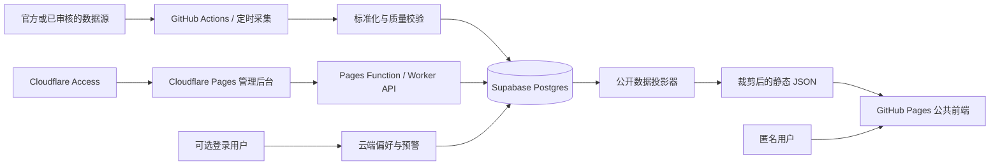

# CycleLens 开发与迁移计划

更新日期：2026-07-18

目标仓库：`jeanmuss/cyclelens`

目标公开地址：`https://jeanmuss.github.io/cyclelens/`

## 1. 已确认的产品与架构决策

1. 产品名使用 **CycleLens**，GitHub 仓库名使用 `cyclelens`。
2. 在购买独立域名前，公共前端继续使用 GitHub Pages，不引入付费域名。
3. 公共页面默认匿名可读，不强迫用户注册或登录。
4. 首页布局和指标选择先保存在设备的 `localStorage`，新设备显示默认首页。
5. 只有“跨设备同步”和“社交媒体指标预警”等服务端能力才要求用户登录。
6. 公共前端不直接连接市场数据源，也不持有任何数据源密钥。
7. 数据采集在后端或 CI 完成，写入数据库并生成经过裁剪的公开快照；浏览器读取快照。
8. 管理员后台与公共前端分开部署。无独立域名阶段，后台可使用受 Cloudflare Access 保护的 `*.pages.dev` 地址。
9. 管理员入口不依赖“隐藏网址”或前端固定密码；访问控制必须在页面内容之前由 Cloudflare Access 执行。
10. A 股页面作为独立功能模块加入，不能继续把新功能堆进共享巨型文件。

## 2. 当前代码审计结论

### 已有优势

- React 页面已经通过 `lazy()` 划分路由代码块，适合继续保留按页面加载。
- 浏览器只读取 `app/public/data/*.json`，数据源密钥停留在脚本和 GitHub Secrets 中。
- 数据管道已经实现来源、抓取时间、转换时间、质量状态和 last-known-good 缓存思想。
- `npm run check` 已覆盖代码检查、单元测试、交易日历验证和生产构建。
- Supabase 已有 `manual_macro_events`、`market_metric_observations` 及修订审计表，数据库不是从零开始。
- GitHub Actions 已能定时采集数据、构建和部署 GitHub Pages。

### 优先重构问题

- `app/src/pages/AppShared.jsx` 约 2300 行，同时承担翻译、导航、状态、数据定义和大量业务组件，修改影响面过大。
- `app/src/styles.css` 约 5000 行，缺少按基础层、组件层和功能页拆分的边界。
- `EquityPage.jsx`、`MacroPage.jsx` 等页面超过 1000 行，展示、计算和数据适配混在一起。
- 多个页面导入大量无关的共享符号，页面模块之间存在不必要的耦合。
- 路由表、导航表、页面元数据分散，新增 A 股等页面需要修改多个位置。
- `deploy-pages.yml` 与 `update-market-data.yml` 重复安装依赖和运行采集步骤，后续容易出现流程漂移。
- 管理员页面当前只在开发模式启用，API 固定为 `127.0.0.1:5174`。
- 当前 `x-cyclelens-admin: 1` 只是本地误操作防护，不是远程身份认证，不能直接暴露到互联网。
- 当前后台“发布”会调用本地 Python 进程并写本地文件；Cloudflare Pages Functions/Workers 无法照搬该执行方式。
- `cycle-map-*` 的 `localStorage` key 在同一个 `username.github.io` 源下会与新站共享，需要命名空间迁移。

## 3. 目标架构



首页的数据采用“数据库为事实来源、静态投影为公开读取层”的折中方案：

- 不让浏览器直接从数据供应商拉取，避免密钥、限流、许可和上游故障直接影响用户。
- 不让匿名浏览器直接查询数据库中的原始表，避免扩大攻击面和查询成本。
- CI 从数据库生成首页所需的小型 JSON 快照，GitHub Pages 继续保持简单、快速和可回滚。
- 真正需要较高实时性的指标可缩短采集与快照频率，但仍经过后端标准化。

## 4. 目标代码边界

不急于更换 React、Vite 或引入大型路由库，先在现有技术栈中建立边界：

```text
app/src/
  app/                    # 启动、路由注册、页面元数据
  features/
    dashboard/            # 首页数据看板
    crypto-cycle/
    crypto-liquidity/
    macro/
    us-equity/
    a-share/
    market-clock/
    chip-chain/
    robot-chain/
    admin-macro-events/   # 仅管理员构建目标引用
  shared/
    components/           # 无业务含义的复用组件
    data/                 # 数据加载、manifest、缓存策略
    i18n/                 # 中英文文案
    routing/              # 单一页面注册表
    formatting/           # 数字、时间、单位格式化
    styles/               # tokens、base、layout、components
  domain/
    metrics/              # 指标目录、单位、质量与新鲜度契约
    markets/              # 市场、交易时段等领域模型
```

所有页面通过统一的 `routeRegistry` 声明路径、导航标题、页面组件、元数据和数据依赖。新增 A 股页面时只增加模块和注册项。

## 5. 分阶段执行计划

### Phase 0：新仓库与迁移基线

- [x] 创建公开空仓库 `jeanmuss/cyclelens`，暂不替换当前 `origin`。（2026-07-18 已验证仓库为空、当前账号具备管理员与推送权限。）
- [x] 当前 `cycle-map` 继续作为开发来源，重构完成并验证后再推送新仓库。（2026-07-18 已确认当前唯一 remote 仍为旧仓库，目标 remote 尚未添加。）
- [x] 记录当前 `main`、未合并分支、`data-cache` 分支和 Pages 设置。（见 `CYCLELENS_MIGRATION_BASELINE.md`；同时记录了本地 `main` 陈旧和 Phase 8 前需复核的仓库外设置。）
- [x] 列出需要迁移的 GitHub Secrets、Variables、Environment 和 Pages 权限，只记录名称，不导出或打印值。（见 `CYCLELENS_MIGRATION_BASELINE.md`。）

验收：新仓库存在且为空；旧站继续正常工作；没有移动或暴露任何密钥。

执行记录（2026-07-18，Phase 0 迁移基线批次）：

- 完成内容：新增 `CYCLELENS_MIGRATION_BASELINE.md`，记录权威 `origin/main`、未合并分支、特殊 `data-cache` 分支、Pages 工作流契约以及待迁移配置名称；未添加新 remote、未推送、未克隆目标仓库。
- 验证结果：GitHub App 确认目标仓库为空且权限可用；旧站只读请求返回 HTTP 200；`app` 目录 `npm run check` 通过（source lint、71 项单元测试、官方交易日历边界验证和生产构建全部成功）；`git diff --check` 通过。
- 剩余风险：本地 `main` 相对 `origin/main` 为 ahead 1 / behind 19，不能作为迁移基线；本机 GitHub CLI 凭据当前失效；GitHub 设置页中的环境保护和仓库级 Actions 默认权限仍需在 Phase 8 前重新核对。
- 下一步：进入 Phase 1 的首个安全网批次，先为现有路由、`useLiveData`、数据 manifest 和旧本地偏好行为补测试，再改品牌配置或存储 key。

### Phase 1：建立安全网并完成品牌迁移准备

- [x] 为路由注册、`useLiveData`、数据 manifest、旧本地偏好迁移增加测试。（2026-07-18 已增加路由解析/管理员 gate、live-data 策略、manifest 生命周期与哈希、本地偏好兼容读取测试；运行时仍使用旧 key，待下一批启用新命名空间。）
- [x] 新增集中产品配置：产品名、仓库基础路径、存储 key 命名空间、构建目标。（2026-07-18 已新增 `app/product.config.mjs`，Vite 与浏览器构建 gate 读取同一配置。）
- [x] 将存储 key 改为 `cyclelens:*`；只做一次兼容读取旧 `cycle-map-*` key，不删除旧站数据。（新 key 缺失时读取旧值，后续 effect 只写新 key；测试确认旧值保持不变。）
- [x] 将硬编码的 `cycle-map` 标识逐步改为配置值，包括页面标题、错误头、管理员 actor 和文档。（2026-07-18 已由集中配置生成浏览器标题、本地主机管理员 header、默认审计 actor 和 Node 数据脚本 User-Agent；仓库文档、图标与 workflow 使用 CycleLens 名称，旧环境变量仅作兼容回退。）
- [x] 保持 Vite 根据 `GITHUB_REPOSITORY` 自动生成 `/cyclelens/` base path 的能力。（已分别以 `jeanmuss/cycle-map` 和 `jeanmuss/cyclelens` 完成真实生产构建，资源路径分别为 `/cycle-map/` 与 `/cyclelens/`。）

验收：`npm run check` 通过；旧 URL 仍可运行；新 base path 的本地构建与资源路径正确。

执行记录（2026-07-18，Phase 1 安全网批次）：

- 完成内容：提取纯路由解析、live-data 策略、本地偏好读写和 manifest contract；页面只改为调用等价 helper，仍写入原 `cycle-map-*` key；新增 19 项定向测试，并为生产管理员路由静态裁剪增加回归契约。
- 验证结果：`npm run check` 通过（source lint、90 项单元测试、官方交易日历边界验证和生产构建全部成功）；生产产物保持页面 lazy chunks，未包含 `MacroAdminRoute`；`git diff --check` 通过。
- 剩余风险：本地偏好迁移算法已有测试但尚未在运行时启用 `cyclelens:*`；`useLiveData` 当前覆盖纯策略，真实 effect/定时器/可见性切换仍依赖后续浏览器集成测试；路由元数据尚未集中为统一 registry。
- 下一步：新增集中产品配置，并用它驱动产品名、仓库 base、存储命名空间和构建目标；随后启用新 key 写入与旧 key 只读回退，不删除旧站数据。

执行记录（2026-07-18，Phase 1 集中配置与存储迁移批次）：

- 完成内容：新增产品名、默认/旧仓库名、Pages base、存储命名空间和 `public`/`development`/`admin` 构建目标的集中配置；公共 build 默认 fail-closed，开发目标保留本地管理员入口；语言与市场时钟偏好改为写入 `cyclelens:*`，仅在新 key 无有效值时读取旧 key。
- 验证结果：`npm run check` 通过（source lint、94 项单元测试、官方交易日历边界验证和生产构建全部成功）；旧 `/cycle-map/` 与新 `/cyclelens/` base 分别完成额外生产构建；两种公共构建均未生成 `MacroAdminRoute` chunk；`git diff --check` 通过。
- 剩余风险：页面标题、错误头、管理员 actor、数据脚本 User-Agent、文档和本地管理员 header 中仍有旧 `cycle-map` 标识；`admin` 构建目标目前只是安全的构建边界基础，尚未部署或开放远程访问。
- 下一步：完成 Phase 1 剩余的品牌标识替换，优先让页面标题、错误信息、管理员审计 actor 和文档读取集中配置，同时保持本地管理员 header 只作为本地误操作防护、绝不作为远程认证。

执行记录（2026-07-18，Phase 1 品牌标识迁移批次）：

- 完成内容：集中配置新增页面标题、User-Agent、本地管理员 header 与默认 actor 契约；浏览器标题统一追加 `CycleLens`，主视图眉题、HTML 初始元数据、favicon、README 和 workflow 改用新品牌；Node/Python 数据脚本的默认 User-Agent 改为 `cyclelens-*`；运行时环境变量以 `CYCLELENS_*` 为主，旧 `CYCLE_MAP_*` 只作显式兼容回退；新增品牌迁移和 actor 优先级回归测试。
- 验证结果：定向迁移测试 38 项通过，新增品牌/actor 定向测试 14 项通过；真实 loopback API 预检只声明 `content-type, x-cyclelens-admin`，旧 header 返回 HTTP 403，新 header 对只读校验返回 HTTP 200；`npm run check` 通过（source lint、100 项单元测试、官方市场日历边界验证和生产构建全部成功）；旧 `/cycle-map/` 与新 `/cyclelens/` 公共构建均成功且不含 `MacroAdminRoute`；浏览器预览确认标题为“风险资产周期与轮动图 | CycleLens”、眉题为 `CYCLELENS` 且无 console warning/error；`git diff --check` 通过。
- 剩余风险：旧仓库名、旧 storage key、旧 Pages base 和 `CYCLE_MAP_*` 环境变量仍作为迁移兼容证据保留，不能在 Phase 8 前移除；本地管理员 header 仍然不是身份认证；路由元数据和超大的 `AppShared.jsx` 尚未模块化。
- 下一步：进入 Phase 2 的第一个可验证批次，先从 `AppShared.jsx` 提取路由/导航 registry 与 i18n/元数据定义，保持所有 lazy route 边界和公共构建管理员裁剪契约不变，并为提取后的纯配置补测试。

### Phase 2：前端模块化重构

- [ ] 先拆 `AppShared.jsx`：路由/导航、i18n、数据定义、公共组件、加密周期组件分别落位。（进展：2026-07-18 第一批已提取统一路由/导航 registry 与双语页面身份/元数据；第二批已提取完整 `TRANSLATIONS`、语言 helper、各 feature copy 和宏观/加密文案 helper；第三批已提取全部 live-data 配置、延迟激活 hook 与 default/valid/hash state helper，并将 `AppShared.jsx` 从 2240 行降到 736 行；公共组件和加密周期组件仍待拆分。）
- [ ] 将每个页面的纯计算函数、数据适配和 React 展示拆开，并为计算函数补单元测试。
- [ ] 按 `tokens.css`、`base.css`、`components.css`、各 feature stylesheet 拆分 `styles.css`。
- [ ] 保留 lazy route 边界，确保首页不会加载 A 股、图表和管理员代码。
- [ ] 删除页面间的反向依赖；功能模块只能依赖 `shared`/`domain`，不能互相导入整个页面。（进展：2026-07-18 已按真实引用移除 29 处无效导入，包括 Market Clock 对整个 Macro 页面和 Crypto 对 chip 数据模块的无效依赖；仍在使用的跨页面 helper/组件待提取。）
- [ ] 建立统一 loading、error、empty、stale、partial-data 状态组件。

验收：无循环依赖；主要路由仍为独立构建 chunk；视觉与现有版本无非预期变化；`npm run check` 通过。

执行记录（2026-07-18，Phase 2 路由 registry 与页面身份批次）：

- 完成内容：新增统一公开路由 registry，集中声明路由 ID、hash/path、公开 lazy loader、导航顺序与静态数据依赖；新增双语页面身份/标题/描述单一来源；`App.jsx`、路由解析、导航、运行时元数据和 8 个 route wrapper 全部改为消费 registry。管理员 loader 继续由 `ADMIN_PAGE_ENABLED` 静态门控，未进入公开 registry loader；`AppShared.jsx` 删除旧导航组件、`t.nav` 和分散的页面元数据。新增 5 个 registry/页面身份/lazy 管理员边界回归测试。
- 验证结果：定向测试 19/19 通过；`npm run lint` 通过；`npm run check` 通过（105 项测试、官方市场日历边界检查和生产构建）；显式 `/cyclelens/` 公开构建保留 7 个独立公开路由 chunk 且不包含管理员 chunk；浏览器逐一验证 7 个公开路由的标题、描述、导航与 active 状态，验证中英文切换，并确认公开构建访问管理员 hash 安全回退且控制台无 warning/error；`git diff --check` 通过。
- 剩余风险：`AppShared.jsx` 仍包含完整 `TRANSLATIONS`、大部分数据/格式化定义和公共展示组件，部分页面的共享导入仍偏宽；registry 中的数据依赖目前是可测试的声明性契约，尚未直接驱动数据加载；本批通过模块构建与测试排除已知循环依赖，但尚未引入独立依赖图检查工具。
- 下一步：继续 Phase 2，提取完整 `TRANSLATIONS`、语言偏好 helper 与各 feature copy 到 `shared/i18n`，补翻译 shape/fallback 测试并收窄页面导入；继续保持 UI、URL、lazy route 和公开构建管理员裁剪行为不变。

执行记录（2026-07-18，Phase 2 i18n 与依赖收窄批次）：

- 完成内容：将完整 `TRANSLATIONS`、语言初始化/locale fallback、US Equity、Market Clock、Chip Chain、Robot Chain 文案以及宏观/加密文案 helper 提取到 `shared/i18n`；`RouteRuntime` 改为从 shared 边界读取语言与翻译。按 AST 真实引用集合收窄所有页面和 `AppShared.jsx` 的命名导入，删除 29 处无效导入并移除失效的 `AppShared` 管理员 re-export；`AppShared.jsx` 从 2240 行降到 923 行。新增 4 项 i18n shape/fallback/架构契约测试，并更新品牌契约测试读取新的单一来源。
- 验证结果：i18n、路由和偏好定向回归 14/14 通过，品牌/i18n 定向回归 8/8 通过；`npm run check` 通过（source lint、109 项测试、官方美/韩/中市场日历边界和生产构建）；显式 `/cyclelens/` 公开构建保留 7 个公开路由 chunk 且管理员 chunk 缺席；浏览器在中英文下逐一验证 7 个公开路由的标题、H1、导航和 active 状态，公开管理员 hash 安全回退且页面诊断日志为空；AST 复核相关页面与 i18n 模块未使用命名导入为 0，41 个前端模块的本地 import 图循环依赖为 0；`git diff --check` 通过。
- 剩余风险：`AppShared.jsx` 仍包含 live-data 配置、hash/default state、公共展示组件、格式化函数和加密周期组件；`EquityPage`/`MacroAdminPage` 仍从 `MacroPage` 读取正在使用的日期 helper，`RobotChainPage` 仍从 `ChipChainPage` 读取正在使用的组件/helper，需要在后续批次提取到 shared/domain 或 feature 内稳定边界；全局 `translations.js` 仍较大，但已是无 React/页面依赖的纯文案模块。
- 下一步：继续 Phase 2，先把 `*_LIVE_DATA` 与轮询常量提取到 `shared/data`，把 default/valid/hash state helper 提取到 `shared/routing`，补纯配置和 URL state 测试；保持页面视觉、路由、语言、lazy chunk 与管理员裁剪行为不变。

执行记录（2026-07-18，Phase 2 数据定义与 URL 状态批次）：

- 完成内容：将 8 组 live-data 数据集定义与统一轮询常量集中到 `shared/data/liveDataDefinitions.js`，将图表延迟激活 hook 提取到独立模块并保留 idle/timeout 清理语义；将加密、股票、宏观、芯片和机器人页面的默认值、允许值、hash 解析及 URL 序列化/替换 helper 提取到 `shared/routing/routeViewState.js`。所有消费页面改为从稳定 shared 边界导入，Crypto Liquidity 删除重复配置；`AppShared.jsx` 从 923 行降到 736 行。新增 live-data registry 对齐、不可变配置、URL fail-closed 解析、序列化和架构边界测试；`data.js` 的 Vite base 读取改为可选访问，使纯模块可由原生 Node 安全加载而不改变浏览器构建结果。
- 验证结果：live-data、URL state、路由与现有轮询策略定向回归 23/23 通过；`npm run check` 通过（source lint、117 项测试、官方美/韩/中市场日历边界和生产构建）；显式 `/cyclelens/` public 构建生成 7 个公开路由 chunk、资源 base 正确且无 `MacroAdminRoute`；浏览器逐一验证 7 个公开路由的标题、H1、导航和 active 状态，并验证有效/非法 hash、控件触发 URL 更新与 public 管理员 hash 安全回退，页面日志为空；44 个前端模块的静态 import 图循环依赖为 0、未使用命名导入为 0；`git diff --check` 通过。
- 剩余风险：`AppShared.jsx` 仍包含公共控件、新鲜度/可信度展示、格式化函数和加密周期组件；`routeViewState.js` 暂时仍通过根 `data.js` 读取资产列表与 base helper，后续应随 shared/domain 边界继续下沉；`EquityPage`/`MacroAdminPage` 对 `MacroPage`、`RobotChainPage` 对 `ChipChainPage` 的在用跨页面依赖仍待消除；registry 的数据依赖仍是受测试保护的声明，尚未直接驱动 loader。
- 下一步：继续 Phase 2，先把通用格式化 helper 与 loading/error/empty/stale/partial-data、分段控件和新鲜度/可信度展示组件提取到 `shared/formatting` 与 `shared/components`，再独立加密周期组件；保持 hook 顺序、effect 清理、视觉、URL、lazy chunk 和 public 管理员裁剪不变。

### Phase 3：指标目录与数据管道重构

- [ ] 新建 `metric_catalog` 概念，统一 `metric_id`、标题、单位、频率、来源、可见性、质量和默认展示方式。
- [ ] 保留并扩展现有 `market_metric_observations`，避免为每个新页面创建互不兼容的数据格式。
- [ ] 为每类数据源建立 adapter：fetch、normalize、validate、persist、project 五个阶段。
- [ ] 数据持久化采用幂等 upsert，保留首次抓取、最后检查、修订历史和 last-known-good。
- [ ] 生成按页面裁剪的公开投影文件，并对投影文件做 schema/contract 测试。
- [ ] 将 Actions 拆为“采集持久化”“生成公开快照”“构建部署”，用 reusable workflow 减少重复。
- [ ] 审查每个数据源的许可、再分发、缓存和署名要求；未审核来源不能进入生产。

验收：任一上游失败不会清空上次成功数据；公开快照不包含密钥、内部字段或个人数据；来源和新鲜度可追踪。

### Phase 4：首页可定制数据看板

- [ ] 首页成为 `/`，原加密周期页移动到明确路由，例如 `#/crypto-cycle`。
- [ ] 建立 widget registry：每个卡片声明指标依赖、尺寸、默认位置、可用市场和渲染组件。
- [ ] 提供一套主要指标默认布局，匿名用户无需配置即可使用。
- [ ] 支持显示/隐藏、排序和恢复默认；第一版不必实现复杂自由拖拽。
- [ ] 使用带 `version` 的 `localStorage` JSON 保存设备本地偏好，并做结构校验和迁移。
- [ ] 首页只读取 dashboard projection，不向每个来源分别发请求。
- [ ] 指标卡必须显示更新时间、质量状态或可进入统一数据说明区。

验收：未登录用户可完整浏览和定制；刷新后本设备配置保留；新设备显示默认布局；坏的本地数据会安全回退。

### Phase 5：A 股独立页面

- [ ] 在 `features/a-share` 中建立独立模块，与“美股宏观”并列，不复制美股页面代码。
- [ ] 先确认 MVP 指标范围，再确认官方或经过审核的数据源、许可和刷新频率。
- [ ] 使用通用指标目录、图表组件、新鲜度与质量契约。
- [ ] 市场时钟复用现有 SSE/SZSE 官方日历逻辑，行情和交易状态语义保持分离。
- [ ] 为未来行业、指数、流动性、北向资金等扩充预留指标分类，但不提前存储无用数据。

验收：新增页面只需要 feature 模块、数据 adapter 和路由注册；不修改其他页面的业务实现。

### Phase 6：可联网访问的管理员后台 MVP

- [ ] 使用独立管理员构建目标，公共 GitHub Pages 构建不包含管理员路由入口。
- [ ] 将管理员静态界面部署到免费的 `cyclelens-admin.pages.dev`（最终名称以 Cloudflare 可用性为准）。
- [ ] 在 `*.pages.dev` 生产域和预览域前启用 Cloudflare Access，只允许 Cloudflare 账号成员或指定邮箱。
- [ ] 优先使用 Cloudflare 账号身份/MFA；备选是指定邮箱 OTP。不要实现共享静态密码。
- [ ] 将本地 Node API 改为 Pages Function 或 Worker；Supabase secret 只保存为 Cloudflare secret。
- [ ] API 校验 Access 身份、请求来源、方法、body 大小和字段 schema，并记录不含敏感信息的审计 actor。
- [ ] 删除对 `x-cyclelens-admin: 1` 的远程信任；该 header 不能作为认证依据。
- [ ] 远程后台只负责数据库 CRUD。当前调用 Python 子进程生成 JSON 的“发布”流程改为排队，交给 GitHub Actions/定时投影任务执行。
- [ ] 第一版允许“保存后等待下一轮发布”；确认确有需要后，再增加受限的 workflow dispatch，而不是在 Worker 内运行采集脚本。
- [ ] 添加 `noindex`，但明确 URL 隐藏不是安全边界，Access 才是。

验收：未通过 Access 的请求拿不到 HTML 或 API；浏览器包中没有 Supabase secret；管理员修改有审计记录；公共站不受后台故障影响。

### Phase 7：可选账号、跨设备同步与社媒预警

- [ ] 保持匿名浏览和设备本地首页定制，不将登录变成公共阅读门槛。
- [ ] 当用户启用“跨设备同步”或“指标预警”时，再引导登录。
- [ ] 优先选择 magic link、passkey 或合适的 OAuth，避免先建设用户名/密码体系。
- [ ] 增加 `user_dashboard_preferences`、`alert_rules`、`notification_channels`、`notification_deliveries` 等表。
- [ ] 所有用户表启用 RLS，并以 `auth.uid() = user_id` 约束读写；更新策略同时配置 `USING` 和 `WITH CHECK`。
- [ ] Telegram/WeChat 绑定必须有明确验证、解绑、删除和最小化保存策略。
- [ ] 告警判定与发送在服务端定时任务/队列完成，避免浏览器在线状态影响提醒。
- [ ] 对重复发送、重试、频率限制、静默时段和发送日志建立幂等规则。

验收：匿名体验不退化；只有主动启用云功能才产生账号数据；用户不能读取或修改他人的偏好、频道和告警。

### Phase 8：切换到新仓库并上线

- [ ] 在当前 `C:\Users\hovyf\Documents\cycle-map` 中完成重构、全部检查和干净提交；切换前不得遗留未提交文件。
- [ ] 完整检查通过后，将 `cyclelens` 添加为新 remote，保留 Git 历史并推送主分支；在此之前不替换当前 `origin`。
- [ ] 迁移或重新生成 `data-cache` 分支，不把旧临时缓存和本地环境文件带入新仓库。
- [ ] 在新仓库中逐项重新配置 Secrets、Variables、Pages Environment 和 Actions 权限。
- [ ] 启用 GitHub Pages，验证 `https://jeanmuss.github.io/cyclelens/` 的 base path、刷新、hash 路由和 JSON 加载。
- [ ] 对全部页面执行桌面和移动端 smoke test，并检查数据新鲜度、失败回退和可访问性。
- [ ] 新远端推送并验证成功后，将 `jeanmuss/cyclelens` 克隆到 `C:\Users\hovyf\Documents\cyclelens`，再把 Codex 项目/后续开发窗口切换到该目录；不要直接在活动任务中重命名旧工作目录。
- [ ] 保留旧 `cycle-map` Pages 作为短期回滚入口；稳定后将旧仓库归档并在 README 指向新项目。

本机连接记录（2026-07-18）：GitHub App 已确认当前账号对新仓库拥有管理员与推送权限；公开仓库的只读 Git 连接可用。Windows Git 默认 `schannel` 出现 `SEC_E_NO_CREDENTIALS`，使用单次 `git -c http.sslBackend=openssl ...` 可连接；实际推送前仍需刷新本机 GitHub CLI/凭据管理器认证，不要把 token 写入命令、文件或对话。

验收：新站数据和定时任务稳定运行；旧站仍可回滚；没有在迁移日志、构建产物或仓库中泄露密钥。

## 6. 建议的数据表增量

近期必须：

- `metric_catalog`：指标元数据和公开展示规则。
- 现有 `market_metric_observations`：继续作为标准化时间序列事实表。
- `dashboard_snapshot_runs`：记录公开快照的版本、生成时间、状态和失败摘要；快照本体仍可作为静态 JSON。
- 现有 `manual_macro_events` 与 audit：继续作为管理员编辑对象。

只有账号与预警上线时再增加：

- `user_dashboard_preferences(user_id, schema_version, layout, updated_at)`
- `alert_rules(id, user_id, metric_id, comparator, threshold, cadence, enabled, ...)`
- `notification_channels(id, user_id, provider, external_ref, verified_at, ...)`
- `notification_deliveries(id, rule_id, observation_key, status, attempts, sent_at, ...)`

不要为了首页本地定制提前创建用户表，也不要把匿名用户的设备偏好上传数据库。

## 7. 每个开发窗口的执行规则

1. 开始前阅读根目录 `AGENTS.md`、相关子目录 `AGENTS.md` 和本计划。
2. 查看 `git status`，保留用户已有改动，不覆盖无关文件。
3. 一次只领取一个 Phase 中可验证的小批次；不要跨多个 Phase 做不可审查的大提交。
4. 修改前写明本批次验收条件，修改后运行与风险相称的测试，最低要求是 `cd app && npm run check`。
5. 数据或 Supabase 变更必须使用 migration、RLS 和安全审查；不得把 service role/secret 暴露给前端。
6. 数据源变更先审查官方性、许可、凭据、缓存和维护风险。
7. 每次完成后更新本文件的 checklist，并在交接中记录：改了什么、验证结果、剩余风险、下一步。

## 8. 新窗口可直接使用的启动提示

```text
请继续执行 CYCLELENS_DEVELOPMENT_PLAN.md。
先阅读根目录和相关目录的 AGENTS.md，检查 git status、当前分支和最近提交。
只选择计划中尚未完成的最早一个可交付批次，先核对当前代码是否已部分实现，避免重复修改。
保持公共页面匿名可读、设备本地偏好无需登录、市场数据只由后端/CI采集、密钥不进入前端。
完成后运行相应测试并更新计划 checklist，说明本次完成项、验证结果、剩余风险和建议的下一批任务。
```

## 9. 当前建议的实际执行顺序

1. Phase 0：完成新仓库创建和迁移清单。
2. Phase 1：测试安全网、品牌配置和本地存储命名空间。
3. Phase 2：先拆共享文件，再开发首页，避免新功能继续扩大耦合。
4. Phase 3：统一指标目录和公开投影。
5. Phase 4：首页数据看板。
6. Phase 5 与 Phase 6 可在前述契约稳定后分别推进。
7. Phase 7 等真正开始做跨设备同步或社媒提醒时再启动。
8. Phase 8 最后执行，避免半成品过早替换现有稳定站点。
