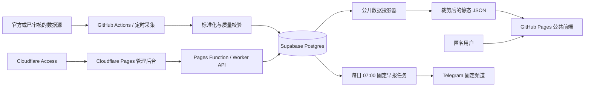

# CycleLens 开发与迁移计划

更新日期：2026-07-20

目标仓库：`jeanmuss/cyclelens`

目标公开地址：`https://jeanmuss.github.io/cyclelens/`

## 1. 已确认的产品与架构决策

1. 产品名使用 **CycleLens**，GitHub 仓库名使用 `cyclelens`。
2. 在购买独立域名前，公共前端继续使用 GitHub Pages，不引入付费域名。
3. 公共页面默认匿名可读，不强迫用户注册或登录。
4. 首页布局和指标选择保存在设备的 `localStorage`，新设备显示默认首页；当前产品不建设跨设备同步。
5. 当前产品不建设用户账号或用户自定义预警。通知能力收敛为运营方维护的一份固定 Telegram 早报，上海时间每日 07:00 推送，不改变公共页面匿名可读边界。
6. 公共前端不直接连接市场数据源，也不持有任何数据源密钥。
7. 数据采集在后端或 CI 完成，写入数据库并生成经过裁剪的公开快照；浏览器读取快照。
8. 管理员后台与公共前端分开部署。无独立域名阶段，后台可使用受 Cloudflare Access 保护的 `*.pages.dev` 地址。
9. 管理员入口不依赖“隐藏网址”或前端固定密码；访问控制必须在页面内容之前由 Cloudflare Access 执行。
10. A 股页面作为独立功能模块加入，不能继续把新功能堆进共享巨型文件。
11. 当前首页的 6 张卡片、13 个默认指标依赖是 Phase 4 的第一版范围，不是完整的跨市场首页终态；美股大盘等指标在仓库迁移后另设阶段扩展。
12. 已完成的 Phase 0-4 与 Phase 6，加上明确暂停并保留架构边界的 Phase 5，已形成可迁移基线。先完成新仓库上线并停运旧 `cycle-map` 的 Pages/定时 Actions，再继续首页指标扩展和 Telegram 早报；暂停中的 A 股页面不阻塞迁移。

## 2. 当前代码审计结论

### 已有优势

- React 页面已经通过 `lazy()` 划分路由代码块，适合继续保留按页面加载。
- 浏览器只读取 `app/public/data/*.json`，数据源密钥停留在脚本和 GitHub Secrets 中。
- 数据管道已经实现来源、抓取时间、转换时间、质量状态和 last-known-good 缓存思想。
- `npm run check` 已覆盖代码检查、单元测试、交易日历验证和生产构建。
- Supabase 已有 `manual_macro_events`、`market_metric_observations` 及修订审计表，数据库不是从零开始。
- GitHub Actions 已能定时采集数据、构建和部署 GitHub Pages。

### 优先重构问题

- `app/src/pages/AppShared.jsx` 约 2300 行，同时承担翻译、导航、状态、数据定义和大量业务组件，修改影响面过大。
- `app/src/styles.css` 约 5000 行，缺少按基础层、组件层和功能页拆分的边界。
- `EquityPage.jsx`、`MacroPage.jsx` 等页面超过 1000 行，展示、计算和数据适配混在一起。
- 多个页面导入大量无关的共享符号，页面模块之间存在不必要的耦合。
- 路由表、导航表、页面元数据分散，新增 A 股等页面需要修改多个位置。
- `deploy-pages.yml` 与 `update-market-data.yml` 重复安装依赖和运行采集步骤，后续容易出现流程漂移。
- 管理员页面当前只在开发模式启用，API 固定为 `127.0.0.1:5174`。
- 当前 `x-cyclelens-admin: 1` 只是本地误操作防护，不是远程身份认证，不能直接暴露到互联网。
- 当前后台“发布”会调用本地 Python 进程并写本地文件；Cloudflare Pages Functions/Workers 无法照搬该执行方式。
- `cycle-map-*` 的 `localStorage` key 在同一个 `username.github.io` 源下会与新站共享，需要命名空间迁移。

## 3. 目标架构



首页的数据采用“数据库为事实来源、静态投影为公开读取层”的折中方案：

- 不让浏览器直接从数据供应商拉取，避免密钥、限流、许可和上游故障直接影响用户。
- 不让匿名浏览器直接查询数据库中的原始表，避免扩大攻击面和查询成本。
- CI 从数据库生成首页所需的小型 JSON 快照，GitHub Pages 继续保持简单、快速和可回滚。
- 真正需要较高实时性的指标可缩短采集与快照频率，但仍经过后端标准化。

## 4. 目标代码边界

不急于更换 React、Vite 或引入大型路由库，先在现有技术栈中建立边界：

```text
app/src/
  app/                    # 启动、路由注册、页面元数据
  features/
    dashboard/            # 首页数据看板
    crypto-cycle/
    crypto-liquidity/
    macro/
    us-equity/
    a-share/
    market-clock/
    chip-chain/
    robot-chain/
    admin-macro-events/   # 仅管理员构建目标引用
  shared/
    components/           # 无业务含义的复用组件
    data/                 # 数据加载、manifest、缓存策略
    i18n/                 # 中英文文案
    routing/              # 单一页面注册表
    formatting/           # 数字、时间、单位格式化
    styles/               # tokens、base、layout、components
  domain/
    metrics/              # 指标目录、单位、质量与新鲜度契约
    markets/              # 市场、交易时段等领域模型
```

所有页面通过统一的 `routeRegistry` 声明路径、导航标题、页面组件、元数据和数据依赖。新增 A 股页面时只增加模块和注册项。

## 5. 分阶段执行计划

### Phase 0：新仓库与迁移基线

- [x] 创建公开空仓库 `jeanmuss/cyclelens`，暂不替换当前 `origin`。（2026-07-18 已验证仓库为空、当前账号具备管理员与推送权限。）
- [x] 当前 `cycle-map` 继续作为开发来源，重构完成并验证后再推送新仓库。（2026-07-18 已确认当前唯一 remote 仍为旧仓库，目标 remote 尚未添加。）
- [x] 记录当前 `main`、未合并分支、`data-cache` 分支和 Pages 设置。（见 `CYCLELENS_MIGRATION_BASELINE.md`；同时记录了本地 `main` 陈旧和 Phase 8 前需复核的仓库外设置。）
- [x] 列出需要迁移的 GitHub Secrets、Variables、Environment 和 Pages 权限，只记录名称，不导出或打印值。（见 `CYCLELENS_MIGRATION_BASELINE.md`。）

验收：新仓库存在且为空；旧站继续正常工作；没有移动或暴露任何密钥。

执行记录（2026-07-18，Phase 0 迁移基线批次）：

- 完成内容：新增 `CYCLELENS_MIGRATION_BASELINE.md`，记录权威 `origin/main`、未合并分支、特殊 `data-cache` 分支、Pages 工作流契约以及待迁移配置名称；未添加新 remote、未推送、未克隆目标仓库。
- 验证结果：GitHub App 确认目标仓库为空且权限可用；旧站只读请求返回 HTTP 200；`app` 目录 `npm run check` 通过（source lint、71 项单元测试、官方交易日历边界验证和生产构建全部成功）；`git diff --check` 通过。
- 剩余风险：本地 `main` 相对 `origin/main` 为 ahead 1 / behind 19，不能作为迁移基线；本机 GitHub CLI 凭据当前失效；GitHub 设置页中的环境保护和仓库级 Actions 默认权限仍需在 Phase 8 前重新核对。
- 下一步：进入 Phase 1 的首个安全网批次，先为现有路由、`useLiveData`、数据 manifest 和旧本地偏好行为补测试，再改品牌配置或存储 key。

### Phase 1：建立安全网并完成品牌迁移准备

- [x] 为路由注册、`useLiveData`、数据 manifest、旧本地偏好迁移增加测试。（2026-07-18 已增加路由解析/管理员 gate、live-data 策略、manifest 生命周期与哈希、本地偏好兼容读取测试；运行时仍使用旧 key，待下一批启用新命名空间。）
- [x] 新增集中产品配置：产品名、仓库基础路径、存储 key 命名空间、构建目标。（2026-07-18 已新增 `app/product.config.mjs`，Vite 与浏览器构建 gate 读取同一配置。）
- [x] 将存储 key 改为 `cyclelens:*`；只做一次兼容读取旧 `cycle-map-*` key，不删除旧站数据。（新 key 缺失时读取旧值，后续 effect 只写新 key；测试确认旧值保持不变。）
- [x] 将硬编码的 `cycle-map` 标识逐步改为配置值，包括页面标题、错误头、管理员 actor 和文档。（2026-07-18 已由集中配置生成浏览器标题、本地主机管理员 header、默认审计 actor 和 Node 数据脚本 User-Agent；仓库文档、图标与 workflow 使用 CycleLens 名称，旧环境变量仅作兼容回退。）
- [x] 保持 Vite 根据 `GITHUB_REPOSITORY` 自动生成 `/cyclelens/` base path 的能力。（已分别以 `jeanmuss/cycle-map` 和 `jeanmuss/cyclelens` 完成真实生产构建，资源路径分别为 `/cycle-map/` 与 `/cyclelens/`。）

验收：`npm run check` 通过；旧 URL 仍可运行；新 base path 的本地构建与资源路径正确。

执行记录（2026-07-18，Phase 1 安全网批次）：

- 完成内容：提取纯路由解析、live-data 策略、本地偏好读写和 manifest contract；页面只改为调用等价 helper，仍写入原 `cycle-map-*` key；新增 19 项定向测试，并为生产管理员路由静态裁剪增加回归契约。
- 验证结果：`npm run check` 通过（source lint、90 项单元测试、官方交易日历边界验证和生产构建全部成功）；生产产物保持页面 lazy chunks，未包含 `MacroAdminRoute`；`git diff --check` 通过。
- 剩余风险：本地偏好迁移算法已有测试但尚未在运行时启用 `cyclelens:*`；`useLiveData` 当前覆盖纯策略，真实 effect/定时器/可见性切换仍依赖后续浏览器集成测试；路由元数据尚未集中为统一 registry。
- 下一步：新增集中产品配置，并用它驱动产品名、仓库 base、存储命名空间和构建目标；随后启用新 key 写入与旧 key 只读回退，不删除旧站数据。

执行记录（2026-07-18，Phase 1 集中配置与存储迁移批次）：

- 完成内容：新增产品名、默认/旧仓库名、Pages base、存储命名空间和 `public`/`development`/`admin` 构建目标的集中配置；公共 build 默认 fail-closed，开发目标保留本地管理员入口；语言与市场时钟偏好改为写入 `cyclelens:*`，仅在新 key 无有效值时读取旧 key。
- 验证结果：`npm run check` 通过（source lint、94 项单元测试、官方交易日历边界验证和生产构建全部成功）；旧 `/cycle-map/` 与新 `/cyclelens/` base 分别完成额外生产构建；两种公共构建均未生成 `MacroAdminRoute` chunk；`git diff --check` 通过。
- 剩余风险：页面标题、错误头、管理员 actor、数据脚本 User-Agent、文档和本地管理员 header 中仍有旧 `cycle-map` 标识；`admin` 构建目标目前只是安全的构建边界基础，尚未部署或开放远程访问。
- 下一步：完成 Phase 1 剩余的品牌标识替换，优先让页面标题、错误信息、管理员审计 actor 和文档读取集中配置，同时保持本地管理员 header 只作为本地误操作防护、绝不作为远程认证。

执行记录（2026-07-18，Phase 1 品牌标识迁移批次）：

- 完成内容：集中配置新增页面标题、User-Agent、本地管理员 header 与默认 actor 契约；浏览器标题统一追加 `CycleLens`，主视图眉题、HTML 初始元数据、favicon、README 和 workflow 改用新品牌；Node/Python 数据脚本的默认 User-Agent 改为 `cyclelens-*`；运行时环境变量以 `CYCLELENS_*` 为主，旧 `CYCLE_MAP_*` 只作显式兼容回退；新增品牌迁移和 actor 优先级回归测试。
- 验证结果：定向迁移测试 38 项通过，新增品牌/actor 定向测试 14 项通过；真实 loopback API 预检只声明 `content-type, x-cyclelens-admin`，旧 header 返回 HTTP 403，新 header 对只读校验返回 HTTP 200；`npm run check` 通过（source lint、100 项单元测试、官方市场日历边界验证和生产构建全部成功）；旧 `/cycle-map/` 与新 `/cyclelens/` 公共构建均成功且不含 `MacroAdminRoute`；浏览器预览确认标题为“风险资产周期与轮动图 | CycleLens”、眉题为 `CYCLELENS` 且无 console warning/error；`git diff --check` 通过。
- 剩余风险：旧仓库名、旧 storage key、旧 Pages base 和 `CYCLE_MAP_*` 环境变量仍作为迁移兼容证据保留，不能在 Phase 8 前移除；本地管理员 header 仍然不是身份认证；路由元数据和超大的 `AppShared.jsx` 尚未模块化。
- 下一步：进入 Phase 2 的第一个可验证批次，先从 `AppShared.jsx` 提取路由/导航 registry 与 i18n/元数据定义，保持所有 lazy route 边界和公共构建管理员裁剪契约不变，并为提取后的纯配置补测试。

### Phase 2：前端模块化重构

- [x] 先拆 `AppShared.jsx`：路由/导航、i18n、数据定义、公共组件、加密周期组件分别落位。`AppShared.jsx` 已删除，路由、文案、数据定义、格式化、公共组件和加密周期组件均有稳定边界。
- [x] 将每个页面的纯计算函数、数据适配和 React 展示拆开，并为计算函数补单元测试。宏观、美股、市场时钟、芯片链、机器人链和管理员适配均已拆到无 React 的 model/domain 模块，加密与流动性继续复用既有纯计算模块和测试。
- [x] 按 `tokens.css`、`base.css`、`components.css`、各 feature stylesheet 拆分 `styles.css`。入口仅保留有序 `@import`，拆分时逐字节重组验证与原文件一致。
- [x] 保留 lazy route 边界，确保首页不会加载 A 股、图表和管理员代码。路由元数据与 lazy loader 已解耦，公开构建生成 7 个独立路由 chunk，管理员页面代码未进入公开构建。
- [x] 删除页面间的反向依赖；功能模块只能依赖 `shared`/`domain`，不能互相导入整个页面。日期与供应链通用计算已下沉，完整本地 import 图无循环依赖。
- [x] 建立统一 loading、error、empty、stale、partial-data 状态组件。公开页面和路由 fallback 已统一消费 `DataState`，五种状态值由契约测试保护。

验收：无循环依赖；主要路由仍为独立构建 chunk；视觉与现有版本无非预期变化；`npm run check` 通过。

执行记录（2026-07-18，Phase 2 路由 registry 与页面身份批次）：

- 完成内容：新增统一公开路由 registry，集中声明路由 ID、hash/path、公开 lazy loader、导航顺序与静态数据依赖；新增双语页面身份/标题/描述单一来源；`App.jsx`、路由解析、导航、运行时元数据和 8 个 route wrapper 全部改为消费 registry。管理员 loader 继续由 `ADMIN_PAGE_ENABLED` 静态门控，未进入公开 registry loader；`AppShared.jsx` 删除旧导航组件、`t.nav` 和分散的页面元数据。新增 5 个 registry/页面身份/lazy 管理员边界回归测试。
- 验证结果：定向测试 19/19 通过；`npm run lint` 通过；`npm run check` 通过（105 项测试、官方市场日历边界检查和生产构建）；显式 `/cyclelens/` 公开构建保留 7 个独立公开路由 chunk 且不包含管理员 chunk；浏览器逐一验证 7 个公开路由的标题、描述、导航与 active 状态，验证中英文切换，并确认公开构建访问管理员 hash 安全回退且控制台无 warning/error；`git diff --check` 通过。
- 剩余风险：`AppShared.jsx` 仍包含完整 `TRANSLATIONS`、大部分数据/格式化定义和公共展示组件，部分页面的共享导入仍偏宽；registry 中的数据依赖目前是可测试的声明性契约，尚未直接驱动数据加载；本批通过模块构建与测试排除已知循环依赖，但尚未引入独立依赖图检查工具。
- 下一步：继续 Phase 2，提取完整 `TRANSLATIONS`、语言偏好 helper 与各 feature copy 到 `shared/i18n`，补翻译 shape/fallback 测试并收窄页面导入；继续保持 UI、URL、lazy route 和公开构建管理员裁剪行为不变。

执行记录（2026-07-18，Phase 2 i18n 与依赖收窄批次）：

- 完成内容：将完整 `TRANSLATIONS`、语言初始化/locale fallback、US Equity、Market Clock、Chip Chain、Robot Chain 文案以及宏观/加密文案 helper 提取到 `shared/i18n`；`RouteRuntime` 改为从 shared 边界读取语言与翻译。按 AST 真实引用集合收窄所有页面和 `AppShared.jsx` 的命名导入，删除 29 处无效导入并移除失效的 `AppShared` 管理员 re-export；`AppShared.jsx` 从 2240 行降到 923 行。新增 4 项 i18n shape/fallback/架构契约测试，并更新品牌契约测试读取新的单一来源。
- 验证结果：i18n、路由和偏好定向回归 14/14 通过，品牌/i18n 定向回归 8/8 通过；`npm run check` 通过（source lint、109 项测试、官方美/韩/中市场日历边界和生产构建）；显式 `/cyclelens/` 公开构建保留 7 个公开路由 chunk 且管理员 chunk 缺席；浏览器在中英文下逐一验证 7 个公开路由的标题、H1、导航和 active 状态，公开管理员 hash 安全回退且页面诊断日志为空；AST 复核相关页面与 i18n 模块未使用命名导入为 0，41 个前端模块的本地 import 图循环依赖为 0；`git diff --check` 通过。
- 剩余风险：`AppShared.jsx` 仍包含 live-data 配置、hash/default state、公共展示组件、格式化函数和加密周期组件；`EquityPage`/`MacroAdminPage` 仍从 `MacroPage` 读取正在使用的日期 helper，`RobotChainPage` 仍从 `ChipChainPage` 读取正在使用的组件/helper，需要在后续批次提取到 shared/domain 或 feature 内稳定边界；全局 `translations.js` 仍较大，但已是无 React/页面依赖的纯文案模块。
- 下一步：继续 Phase 2，先把 `*_LIVE_DATA` 与轮询常量提取到 `shared/data`，把 default/valid/hash state helper 提取到 `shared/routing`，补纯配置和 URL state 测试；保持页面视觉、路由、语言、lazy chunk 与管理员裁剪行为不变。

执行记录（2026-07-18，Phase 2 数据定义与 URL 状态批次）：

- 完成内容：将 8 组 live-data 数据集定义与统一轮询常量集中到 `shared/data/liveDataDefinitions.js`，将图表延迟激活 hook 提取到独立模块并保留 idle/timeout 清理语义；将加密、股票、宏观、芯片和机器人页面的默认值、允许值、hash 解析及 URL 序列化/替换 helper 提取到 `shared/routing/routeViewState.js`。所有消费页面改为从稳定 shared 边界导入，Crypto Liquidity 删除重复配置；`AppShared.jsx` 从 923 行降到 736 行。新增 live-data registry 对齐、不可变配置、URL fail-closed 解析、序列化和架构边界测试；`data.js` 的 Vite base 读取改为可选访问，使纯模块可由原生 Node 安全加载而不改变浏览器构建结果。
- 验证结果：live-data、URL state、路由与现有轮询策略定向回归 23/23 通过；`npm run check` 通过（source lint、117 项测试、官方美/韩/中市场日历边界和生产构建）；显式 `/cyclelens/` public 构建生成 7 个公开路由 chunk、资源 base 正确且无 `MacroAdminRoute`；浏览器逐一验证 7 个公开路由的标题、H1、导航和 active 状态，并验证有效/非法 hash、控件触发 URL 更新与 public 管理员 hash 安全回退，页面日志为空；44 个前端模块的静态 import 图循环依赖为 0、未使用命名导入为 0；`git diff --check` 通过。
- 剩余风险：`AppShared.jsx` 仍包含公共控件、新鲜度/可信度展示、格式化函数和加密周期组件；`routeViewState.js` 暂时仍通过根 `data.js` 读取资产列表与 base helper，后续应随 shared/domain 边界继续下沉；`EquityPage`/`MacroAdminPage` 对 `MacroPage`、`RobotChainPage` 对 `ChipChainPage` 的在用跨页面依赖仍待消除；registry 的数据依赖仍是受测试保护的声明，尚未直接驱动 loader。
- 下一步：继续 Phase 2，先把通用格式化 helper 与 loading/error/empty/stale/partial-data、分段控件和新鲜度/可信度展示组件提取到 `shared/formatting` 与 `shared/components`，再独立加密周期组件；保持 hook 顺序、effect 清理、视觉、URL、lazy chunk 和 public 管理员裁剪不变。

执行记录（2026-07-18，Phase 2 前端模块化完成批次）：

- 完成内容：删除剩余 `AppShared.jsx`，将分段控件、语言切换、缓存/新鲜度/可信度展示、格式化 helper 和加密周期展示组件拆入 `shared`/feature；新增统一 `DataState`；将宏观日历、美股图表、市场时钟、芯片链、机器人链和宏观管理员的纯计算/适配拆入无 React model/domain，并把跨 feature 的日期与供应链通用逻辑下沉到 `shared/dates` 和 `domain`；将路由元数据与 lazy loader 解耦；把单体样式按 tokens、base、components、responsive 和 feature 拆为有序样式入口。
- 验证结果：新增模型、架构、样式、状态、路由契约定向测试 18/18 通过；`npm run check` 通过（source lint、130 项测试、官方美/韩/中市场日历边界验证和生产构建）；完整前端相对 import 图循环依赖为 0，feature 模块无页面或兄弟 feature 反向导入；公开构建生成 7 个独立路由 chunk、无 `MacroAdminRoute` chunk；样式拆分时 19 个片段按原顺序重组与原文件逐字节一致；浏览器在桌面宽度和 390px 验证框（内容宽 375px）逐一验证 7 个公开路由，全部 H1 正常、无 error/loading 残留、无横向页面溢出，运行日志为空；`git diff --check` 通过。
- 剩余风险：Vite 仍会把源级拆分样式合并成单个生产 CSS 资源，这是当前预期；路由 registry 的数据依赖仍是受测试保护的声明，尚未直接驱动 loader；`stale` 状态契约已建立，但在没有可靠的按数据集过期阈值前不做主观判定，页面继续展示可审计的 observed/fetched/deployed/client-checked 时间；本批未引入新依赖或密钥。
- 下一步：进入 Phase 3，先定义 `metric_catalog` 的最小 schema 与兼容迁移边界，再选择一个现有数据集完成 fetch/normalize/validate/persist/project 的纵向 adapter 样板，并保持 Phase 8 前不推送或克隆新仓库。

### Phase 3：指标目录与数据管道重构

- [x] 新建 `metric_catalog` 概念，统一 `metric_id`、标题、单位、频率、来源、可见性、质量和默认展示方式。（`src/domain/metrics/metricCatalog.js` 与 Phase 3 migration 共同覆盖当前 14 个持久化指标，并由合同测试校验一致性。）
- [x] 保留并扩展现有 `market_metric_observations`，避免为每个新页面创建互不兼容的数据格式。（新增 catalog 外键边界但不拆事实表；同时新增私有 `dashboard_snapshot_runs`，浏览器角色继续无表权限。）
- [x] 为每类数据源建立 adapter：fetch、normalize、validate、persist、project 五个阶段。（统一 adapter contract 覆盖 JSON API、CSV、HTML、官方披露与禁止的旧非官方 transport，现有 market-history 已完成五阶段纵向接入。）
- [x] 数据持久化采用幂等 upsert，保留首次抓取、最后检查、修订历史和 last-known-good。（继续以 `metric_id + observed_at + source_key` upsert；`fetched_at` 保持首次抓取，`last_checked_at` 单调前进，修订 trigger 与上游失败不写投影的行为均有测试。）
- [x] 生成按页面裁剪的公开投影文件，并对投影文件做 schema/contract 测试。（生成 `projections/crypto-liquidity.json` 与 `projections/us-equity.json`，只保留白名单字段、来源和分离的新鲜度时间。）
- [x] 将 Actions 拆为“采集持久化”“生成公开快照”“构建部署”，用 reusable workflow 减少重复。（新增 `_collect-persist.yml` 与 `_project-public-snapshots.yml`；Pages 构建和 `data-cache` 发布只消费通过合同测试的短期 artifact。）
- [x] 审查每个数据源的许可、再分发、缓存和署名要求；未审核来源不能进入生产。（`DATA_SOURCE_REVIEW.md` 与可执行 source policy 记录审查结论；商业/公共行情来源需显式 approval variable，AKShare/Yahoo 定时生产抓取默认禁止。）

验收：任一上游失败不会清空上次成功数据；公开快照不包含密钥、内部字段或个人数据；来源和新鲜度可追踪。

执行记录（2026-07-18，Phase 3 指标目录与数据管道完成批次）：

- 完成内容：新增统一 metric catalog、来源发布策略、五阶段 adapter contract 和 market-history adapter；新增本地 Supabase migration，扩展私有 catalog/快照运行记录、RLS/最小授权、事实表 catalog 边界与首次抓取/最后检查语义；生成两个按页面裁剪的公开 projection，并纳入 data manifest 与构建；把采集持久化、公开投影、构建部署拆成 reusable workflow 与 artifact 边界；同步来源审查文档和 Phase 8 变量迁移清单。
- 验证结果：`npm run check` 通过（source lint、138/138 单元测试、官方美/韩/中市场日历边界验证、生产构建）；定向 metric/history/manifest 合同测试 21/21 通过；公开 projection 和浏览器 bundle 凭据字段扫描通过；`git diff --check` 通过。上游 fetch 失败时 adapter 在 persist/project 前停止，已由回归测试确认 last-known-good 不被清空。
- 剩余风险：本机未安装 Supabase CLI，一次性下载执行 CLI 因供应链安全策略被阻止，因此 migration 采用仓库时间戳规范创建并只完成静态/RLS 合同验证，尚未连接或修改远端数据库；reusable workflow 尚未在 GitHub 运行，留待迁移前的 CI 验证；新 approval variables 默认关闭，未明确确认许可的来源只保留旧 last-known-good 且不会进入新 projection，当前本地公开 projection 因此仅包含已允许的官方披露/JGB 数据。
- 下一步：进入 Phase 4，新增只消费公开 dashboard projection 的首页和 widget registry；继续保持 Phase 8 前不推送、不添加新 remote、不克隆 `cyclelens`。

### Phase 4：首页可定制数据看板

- [x] 首页成为 `/`，原加密周期页移动到明确路由，例如 `#/crypto-cycle`。
- [x] 建立 widget registry：每个卡片声明指标依赖、尺寸、默认位置、可用市场和渲染组件。
- [x] 提供一套主要指标默认布局，匿名用户无需配置即可使用。
- [x] 支持显示/隐藏、排序和恢复默认；第一版不必实现复杂自由拖拽。
- [x] 使用带 `version` 的 `localStorage` JSON 保存设备本地偏好，并做结构校验和迁移。
- [x] 首页只读取 dashboard projection，不向每个来源分别发请求。
- [x] 指标卡必须显示更新时间、质量状态或可进入统一数据说明区。

验收：未登录用户可完整浏览和定制；刷新后本设备配置保留；新设备显示默认布局；坏的本地数据会安全回退。

执行记录（2026-07-18，Phase 4 首页可定制数据看板完成批次）：

- 完成内容：将 dashboard 注册为默认首页并把原加密周期页迁到 `#/crypto-cycle`；新增 6 个冻结定义的 widget registry、匿名默认布局、显示/隐藏、上下排序和恢复默认；新增带版本、结构校验、v1 迁移及坏数据回退的设备本地偏好；首页只加载单一 dashboard projection，并统一展示观测时间、质量、来源和数据说明。
- 验证结果：`npm run check` 通过（source lint、145/145 单元测试、官方美/韩/中市场日历边界验证、公开投影生成、生产构建）；dashboard projection 生成 4 个指标、121 条观测；浏览器验收覆盖桌面、390px 移动端、隐藏/排序/刷新持久化、恢复默认、根路由与显式加密路由，控制台无 warning/error；`#/crypto-cycle` 的筛选状态曾错误覆写路由，已修复并加入回归测试。
- 剩余风险：13 个默认 widget 指标依赖中，9 个因来源许可 approval 默认关闭而未进入当前公开 projection，界面会明确显示 N/A 与待批准说明，不会伪造或直连来源；布局按设计仅保存在当前设备，不支持跨设备同步；尚未运行远端 CI，也未连接或修改 Supabase/GitHub。
- 下一步：进入 Phase 5，先确认 A 股 MVP 指标、审核数据源与许可边界，再复用现有指标目录、公开投影和市场日历契约；继续保持 Phase 8 前不推送、不添加新 remote、不克隆 `cyclelens`。

后续数据源决策（2026-07-18）：13 项明细、原始候选行数、替代来源审查和当前可用性见 [`docs/data/DASHBOARD_DEFAULT_METRICS.md`](docs/data/DASHBOARD_DEFAULT_METRICS.md)。CMC 发布开关按产品决定默认置为 `1`，Strategy 持仓改为官方披露；重建后 13 个默认依赖中 7 个可用、6 个 N/A。Binance/OKX 的官方公开 API 不提供等价的全市场稳定币流通市值或美国现货 ETF 净流量，不能用价格/成交量改变指标语义来填空。

### Phase 5：A 股独立页面

- [ ] 在 `features/a-share` 中建立独立模块，与“美股宏观”并列，不复制美股页面代码。
- [ ] 先确认 MVP 指标范围，再确认官方或经过审核的数据源、许可和刷新频率。
- [ ] 使用通用指标目录、图表组件、新鲜度与质量契约。
- [ ] 市场时钟复用现有 SSE/SZSE 官方日历逻辑，行情和交易状态语义保持分离。
- [ ] 为未来行业、指数、流动性、北向资金等扩充预留指标分类，但不提前存储无用数据。

验收：新增页面只需要 feature 模块、数据 adapter 和路由注册；不修改其他页面的业务实现。

暂停记录（2026-07-18）：产品决定暂缓 A 股页面实现，先与其他开发者讨论信源、展示许可、缓存和署名边界。判断依据、建议 MVP、东方财富/雪球风险与架构预留统一记录在 [`docs/product/A_SHARE_PAGE_HOLD.md`](docs/product/A_SHARE_PAGE_HOLD.md)。本阶段 checklist 保持未完成；当前不注册空路由、不创建空 feature 或存储无用数据，仅保留 `a-share.*` 命名空间、未来 projection/adapter/路由边界。按第 9 节既有规则，Phase 5 与 Phase 6 可分别推进，因此该产品暂停不阻塞 Phase 6。

执行记录（2026-07-18，Phase 5 暂停与数据源决策批次）：

- 完成内容：落库 A 股页面暂停判断与架构预留文档、首页 13 指标可用性清单和 Binance/OKX 官方 API 替代审查；CMC 发布开关默认置为 `1` 且保留显式 `0` 的停用能力；Strategy 持仓从 SoSoValue 采集路径、指标目录和公开 LKG 中移除，改为审核后的 Strategy 官方披露，并新增确定性应用脚本与 Supabase catalog migration。
- 验证结果：数据源/指标/工作流定向回归 41/41 通过；`npm run check` 通过（source lint、148/148 单元测试、官方美/韩/中市场日历边界验证、公开投影生成和生产构建）；dashboard 投影为 8 个指标/136 条观测，其中 13 个默认依赖为 7 个可用、6 个 N/A，额外 1 个为非默认的 CMC USDT 脱锚指标；Strategy 公共历史只保留 1 条官方观测；`git diff --check` 通过。
- 剩余风险：CMC 的产品批准不能替代套餐条款持续复核；DefiLlama 稳定币市值与 SoSoValue ETF 流量仍未获发布批准且 Binance/OKX 没有等价字段；Strategy 官方历史暂时比第三方聚合历史短；新 migration 仅完成本地静态与合同验证，尚未连接或修改远端 Supabase。
- 下一步：进入 Phase 6，先审计独立 admin build、Cloudflare Pages/Access、Pages Function/Worker 和 Supabase CRUD 的现有边界；外部账号与 secrets 若只在部署时需要则后补，不阻塞本地安全代码和测试。

### Phase 6：可联网访问的管理员后台 MVP

部署、安全变量、验证与回滚交接见 [`docs/deployment/ADMIN_CLOUDFLARE.md`](docs/deployment/ADMIN_CLOUDFLARE.md)。

- [x] 使用独立管理员构建目标，公共 GitHub Pages 构建不包含管理员路由入口。
- [x] 将管理员静态界面部署到免费的 `cyclelens-admin.pages.dev`（最终名称以 Cloudflare 可用性为准）。
- [x] 在 `*.pages.dev` 生产域和预览域前启用 Cloudflare Access，只允许 Cloudflare 账号成员或指定邮箱。
- [x] 优先使用 Cloudflare 账号身份/MFA；备选是指定邮箱 OTP。不要实现共享静态密码。
- [x] 将本地 Node API 改为 Pages Function 或 Worker；Supabase secret 只保存为 Cloudflare secret。
- [x] API 校验 Access 身份、请求来源、方法、body 大小和字段 schema，并记录不含敏感信息的审计 actor。
- [x] 删除对 `x-cyclelens-admin: 1` 的远程信任；该 header 不能作为认证依据。
- [x] 远程后台只负责数据库 CRUD。当前调用 Python 子进程生成 JSON 的“发布”流程改为排队，交给 GitHub Actions/定时投影任务执行。
- [x] 第一版允许“保存后等待下一轮发布”；确认确有需要后，再增加受限的 workflow dispatch，而不是在 Worker 内运行采集脚本。
- [x] 添加 `noindex`，但明确 URL 隐藏不是安全边界，Access 才是。

验收：未通过 Access 的请求拿不到 HTML 或 API；浏览器包中没有 Supabase secret；管理员修改有审计记录；公共站不受后台故障影响。

执行记录（2026-07-18，Phase 6 本地安全构建批次）：

- 完成内容：新增固定版本 Wrangler、独立 `admin` 构建、管理端根路由、`noindex` 与覆盖全部路径的 Pages Functions 路由；新增根 middleware，对 HTML/静态资源/API 验证 Cloudflare Access RS256 JWT；新增同源 Pages API、共享事件 schema、64 KiB/300 条上限、Supabase CRUD 映射和经哈希的非敏感审计 actor；远程 UI 改为同源 `/api`，静态移除本地 header、校验/发布按钮和 Python 发布调用，保存结果明确为等待下一轮静态投影；部署交接记录了变量、grants、Access、smoke test 和回滚边界。
- 验证结果：`npm run check` 通过（source lint、158/158 单元测试、官方美/韩/中市场日历验证、公开 projection 生成与公开生产构建）；`npm run build:admin` 和 `npm run build:admin:functions` 通过，Wrangler 4.112.0 成功编译 Worker；公开产物边界扫描确认没有管理路由/API 标记、`_routes.json` 或 `noindex`，管理产物确认独立管理 chunk、`noindex`、`/*` 路由和远程代码边界；Worker 扫描未发现本地管理 header、回环地址、Python/子进程、即时发布命令或凭据值；新增依赖安装报告 0 vulnerabilities；`git diff --check` 通过。
- 剩余风险：本批没有连接或修改远程 Cloudflare/Supabase。Pages 项目、生产/预览 Access policy、MFA/OTP、encrypted secrets 和真实 JWT 尚未验证；`manual_macro_events` 仍需一个通过 Supabase migration 历史创建并应用的最小 `service_role` grants migration 后才能远程 CRUD；整表替换当前由多次 PostgREST 请求组成，不是跨请求事务，多人并发前应升级为带版本校验的事务 RPC。
- 下一步：部署批次先明确 Supabase 项目，使用已连接的 Supabase 工具或官方 CLI 创建/应用 grants migration 并运行 security/performance advisors；随后 Wrangler 登录、创建 Pages 项目、配置 Access 与 secrets、部署并按交接文档执行生产/预览 smoke test。上述账户配置可后补，本批无需用户提供或在对话中发送任何 secret。

执行记录（2026-07-19，Phase 6 远程部署与验收批次）：

- 完成内容：复用并升级 CycleLens 前身的现有 Supabase 项目，应用 `phase6_admin_grants_and_legacy_catalog` migration，保留全部既有数据并显式收紧管理表/trigger 权限；为 Pages Functions 创建独立后端 key（Supabase 显示名 `cyclelens_admin_pages`）；创建 `cyclelens-admin` Direct Upload Pages 项目，部署生产与 `phase6-preview` 预览产物；为生产精确域和预览通配域分别启用 fail-closed Cloudflare Access 指定邮箱 OTP；生产和预览均配置六项 encrypted secrets。
- 验证结果：migration 前后手动事件 1、审计 1、指标观测 13,714、修订 558，catalog 15 项/14 active 且无未编目观测；匿名生产根路径/API、预览 alias/hash 均返回 Access `302`，旧公开 GitHub Pages 返回 `200`；OTP 登录后生产后台和受保护 API 成功读取原有事件；真实保存唯一临时草稿后生成合规 `cf-access:<24 hex>` INSERT 审计，清理后事件数恢复为 1，INSERT/DELETE 审计各 1 条且 actor 合规；Security Advisor 0，Performance Advisor 仅 5 条 `unused_index` INFO；`npm run check` 通过（158/158 测试、市场日历校验、公开投影和生产构建），admin 与 Functions 构建及 Wrangler 4.112.0 部署成功，`git diff --check` 通过。
- 剩余风险：整表替换仍由多次 PostgREST 请求组成，多管理员并发前需升级为带版本校验的事务 RPC；预览域只验证了匿名 fail closed，没有重复生产端完整 CRUD；速率限制与受限 workflow dispatch 仍按需求后补；5 个未使用索引需在真实流量后复核，当前不删除。
- 下一步：Phase 6 已完成。按 2026-07-19 的产品决定，下一批提前执行 Phase 8 新仓库迁移；Phase 7 收敛为固定 Telegram 早报，不再建设账号、跨设备同步或用户自定义告警。旧站退役只针对 `cycle-map` 的 GitHub Pages 与定时 Actions，不删除当前 CycleLens 继续复用的 Supabase 项目，也不影响 `cyclelens-admin` 或无关的 `alpha-watch` Cloudflare 项目。

### Phase 7：固定 Telegram 每日早报

- [x] 保持匿名浏览和设备本地首页定制，不将登录变成公共阅读门槛。（早报完全由 CI 消费静态 dashboard projection，未修改公共页面或本地偏好。）
- [x] 不建设用户账号、跨设备同步、用户自定义阈值、频道绑定或 WeChat 通知，不创建对应用户表。
- [x] 定义版本化早报 contract：指标清单由产品统一维护，每项带观测时间、新鲜度、质量和来源；缺失值明确显示 N/A，不补零、不拿旧值冒充当日值。（v1 固定为当前首页 8 组/25 项。）
- [ ] 上海时间每日 07:00 由服务端/CI 定时任务生成并发送一份 Telegram 卡片式早报，不依赖浏览器在线状态。（`0 23 * * *` CI 调度与发送 job 已实现；真实发送保持关闭，等待 Telegram 侧配置和一次人工验收。）
- [ ] Telegram bot token 与目标 chat/channel 标识只保存于部署 Secret Store；不进入前端、仓库、构建产物、日志或对话。（workflow 只引用 `TELEGRAM_BOT_TOKEN`/`TELEGRAM_CHAT_ID` Secret 名称，值尚未录入。）
- [x] 使用“上海日期 + contract 版本”作为幂等键，定义安全重试、超时、Telegram 频率限制和脱敏发送日志，避免同一早报重复推送。（同键并发锁 + 90 天脱敏 receipt；仅对明确 429 安全重试一次，超时/5xx 不自动重试。）
- [ ] 先提供 dry-run/渲染快照测试，再启用真实发送；真实启用前由用户在 Telegram 侧创建 bot、将其加入目标频道并通过安全配置路径录入 secret。（本地与 GitHub Actions dry-run 均通过，模板 artifact 已生成且发送 job 跳过；待 Telegram 侧配置、模板确认和真实单次发送。）

验收：匿名体验不退化；仓库和前端不存在 Telegram 凭据；07:00 调度、跨日边界、N/A、新鲜度、幂等与失败重试有确定性测试；真实频道仅收到一份经人工确认模板的早报。

### Phase 8：切换到新仓库并上线

- [x] 在当前 `C:\Users\hovyf\Documents\cycle-map` 中确认已完成的 Phase 0-4/6、Phase 5 暂停边界、全部检查和干净提交；明确延期的 Phase 5/7/9 不阻塞本次切换，切换前不得遗留未提交文件。
- [x] 完整检查通过后，将 `cyclelens` 添加为新 remote，保留 Git 历史并推送主分支；在此之前不替换当前 `origin`。
- [x] 首次推送前先阻止未配置的新仓库工作流自动执行；待 Secrets、Variables、Environment 和最小 Actions 权限配置完成后再启用定时采集与 Pages 部署。（首次推送前已禁用 Actions；2026-07-19 配置完成后才以 GitHub-owned-only 策略启用。）
- [x] 迁移或重新生成 `data-cache` 分支，不把旧临时缓存和本地环境文件带入新仓库。（从已审计的 `26ba446` 基线新建，首次完整数据工作流成功验证持久快照发布路径。）
- [x] 在新仓库中逐项重新配置 Secrets、Variables、Pages Environment 和 Actions 权限。（Secret 只核对名称；Variables 逐项核对值；`github-pages` 仅允许 `main`，默认 `GITHUB_TOKEN` 只读且不能批准 PR。）
- [x] 启用 GitHub Pages，验证 `https://jeanmuss.github.io/cyclelens/` 的 base path、刷新、hash 路由和 JSON 加载。（2026-07-20 已在真实 Chrome 中验证入口、`/cyclelens/` 资源 base、全部 hash 路由刷新保持及各页必需 JSON 加载。）
- [x] 对全部页面执行桌面和移动端 smoke test，并检查数据新鲜度、失败回退和可访问性。（8 个路由 × 2 个视口全部通过；烟测发现并修复首页错误态与加载态重叠，生产 503 模拟和恢复复测通过。）
- [x] 新远端推送并验证成功后，将 `jeanmuss/cyclelens` 克隆到 `C:\Users\hovyf\Documents\cyclelens`，再把 Codex 项目/后续开发窗口切换到该目录；不要直接在活动任务中重命名旧工作目录。（目标目录已独立克隆并验证 `main`、`data-cache`、remote 与对象完整性；本任务只在旧目录完成最后记录，Phase 9 起使用新目录。）
- [x] 新站完成生产 smoke test 后，停止旧 `cycle-map` 的所有定时 Actions 并取消发布旧 GitHub Pages，避免继续消耗运行资源或形成双写；在旧 README/description 指向新项目后归档旧仓库。需要回滚时可临时解除归档并重新启用部署，而不是让两套定时任务长期并行。（旧 README/description 已指向 CycleLens，Actions 已关闭，Pages 已删除并返回 404，仓库已归档只读。）

本机连接记录（2026-07-18）：GitHub App 已确认当前账号对新仓库拥有管理员与推送权限；公开仓库的只读 Git 连接可用。Windows Git 默认 `schannel` 出现 `SEC_E_NO_CREDENTIALS`，使用单次 `git -c http.sslBackend=openssl ...` 可连接；实际推送前仍需刷新本机 GitHub CLI/凭据管理器认证，不要把 token 写入命令、文件或对话。

执行记录（2026-07-19，Phase 8 安全占位上传批次）：

- 完成内容：GitHub CLI 通过系统 keyring 恢复认证；在首次推送前将目标公开仓库 Actions 临时关闭；保留旧 `origin = jeanmuss/cycle-map`，新增 `cyclelens = jeanmuss/cyclelens` remote；经用户在了解公开披露风险后明确授权，将当前完整历史与源码推送为目标仓库 `main`。本地仍停留在 `codex/cyclelens-refactor`，未切换或覆盖旧 remote。
- 验证结果：推送前工作树干净，当前分支相对权威 `origin/main` 为 ahead 15 / behind 0；常见凭据文件名和凭据模式扫描仅命中 example/test 占位值，排除占位文件后的历史补丁扫描为 0 命中（本机未安装 Gitleaks，因此不宣称绝对无泄露风险）；远端 `main` 与本地 `323de33` 完整 SHA 一致，新仓库为公开、默认分支为 `main`、当前账号权限为 ADMIN，Actions 仍为 disabled，未触发任何工作流。
- 剩余风险：新仓库尚无 Secrets、Variables、Environment、`data-cache` 或 Pages 部署；旧站仍在运行。审计还发现现有 reusable workflow 只有在 DefiLlama 获批时才运行 CMC/DefiLlama/SoSoValue 共用刷新步骤，并在步骤内把 DefiLlama 标记硬编码为开启，与“CMC 开启、DefiLlama 关闭”的产品决策不一致，修复前不得启用 Actions。
- 下一步：修复并测试来源门控；为新仓库写入显式的最小安全 Variables，并由用户通过 GitHub Secret Store 安全补录仍在使用的 Secret；随后创建 `github-pages` Environment、恢复最小 Actions 权限、引导生成 `data-cache` 并部署新 Pages。新站完整验收前不停止旧站。

执行记录（2026-07-19，Phase 8 来源门控与仓库策略配置批次）：

- 完成内容：完整刷新现在始终运行加密流动性聚合器，使官方 Strategy/SEC 路径不再依赖 DefiLlama 审批；CMC、DefiLlama、SoSoValue 与 BlockBeats 分别读取自己的 gate，移除 DefiLlama 硬编码开启；新增 workflow governance 回归测试。新仓库显式配置 10 个非敏感 Variables：CMC 与必需市场历史为 `1`，DefiLlama、SoSoValue、BlockBeats、公共加密端点、Alpaca、FRED 第三方序列和 ADP 均为 `0`。
- 验证结果：定向 workflow governance 测试 6/6 通过；`npm run check` 通过（source lint、159/159 测试、美国/韩国/中国官方市场日历、三份公开投影与生产构建）；新仓库 10 个 Variables 逐项读取为预期 0/1；`CMC_PRO_API_KEY`、`SUPABASE_URL`、`SUPABASE_SECRET_KEY` 三个 Secret 名称存在但未读取值，其中 Supabase 控制台显示名由用户确认为 `cyclelens_github_actions`；Actions 继续保持 disabled。
- 剩余风险：GitHub Secret Store 不允许回读值，因此新 CMC/Supabase 凭据只能在首轮工作流中完成真实验证；`SEC_USER_AGENT` 尚未配置，BitMine SEC 持仓自动刷新会保留现有审核数据但不拉取新披露；`github-pages` Environment、`data-cache`、Pages 与 Actions 权限仍未完成，旧站继续运行。
- 下一步：提交并同步本批修复；随后从当前已审计的主分支引导生成新仓库 `data-cache`，创建 `github-pages` Environment 与 Pages 配置，保持最小 workflow 权限，最后启用 Actions 并手动运行一次完整采集/投影/部署以验证真实 Secret。

执行记录（2026-07-19，Phase 8 首次 CI 与 Pages 上线批次）：

- 完成内容：从当前公开且已审计的 `26ba446` 初始化新仓库 `data-cache`，没有迁移旧缓存分支或本地环境文件；创建 workflow 模式 GitHub Pages 和 `github-pages` Environment，并将部署分支限制为 `main`；仓库 Actions 仅允许 GitHub 官方 `actions/*`，默认 `GITHUB_TOKEN` 为只读且不能批准 PR，各 workflow 继续按 job 显式申请最小写权限；保留此前只按名称录入的三个 Secret 和十个显式来源 Variables。首轮运行后继续审计 artifact，发现 upload-artifact 以 `app/` 为共同根、而三个 download 步骤错误解压到仓库根，导致生成的根级 `public/`/`data/` 未被后续 `app/*` 消费；提交 `a47022a` 将采集输入、公开投影构建输入和 `data-cache` 发布输入全部恢复到 `app/`，并增加三项路径回归断言。旧 `cycle-map` Pages/Actions 本批未停用。
- 验证结果：首轮 `Update market caches` run `29692566692` 已真实通过 CMC 刷新、Supabase 手工事件同步和必需市场历史持久化（写入 1,839 行），但因上述 artifact 路径缺陷，不作为公开投影/`data-cache` 验收依据；首轮 `Deploy GitHub Pages` run `29692615554` 同理只证明旧基线可构建。修复后 push 触发的 Pages run `29692945866` 完整通过采集、持久化、投影合同、source lint、159/159 测试、官方市场日历、生产构建和部署；线上 `crypto-liquidity.json` 的转换时间更新为 `2026-07-19T15:29:48.424Z`（本地旧基线为 `2026-07-16T08:49:09.863Z`），manifest 生成时间为 `2026-07-19T15:30:17.301Z` 且含 12 个数据集，入口、dashboard projection 以及带 `/cyclelens/` base 的 JS/CSS 均返回 HTTP 200。修复后的 `Update market caches` run `29693011142` 成功并生成 `data-cache` 提交 `271137a`，分支内加密流动性转换时间为 `2026-07-19T15:31:44.125Z`，证明新快照已写入正确路径。本地 workflow 定向测试 6/6 与 `npm run check` 均通过（159/159 测试、官方美/韩/中市场日历、三份公开投影与生产构建），`git diff --check` 通过。
- 剩余风险：尚未在真实浏览器中验证全部 hash 路由、刷新、桌面/移动端布局、键盘可达性、失败回退与数据新鲜度；旧站仍在运行，不能提前停用。GitHub 运行器提示若干官方 Action 仍声明 Node 20 runtime 并被强制切换到 Node 24；当前执行成功，但应另批升级受影响的 Action major 并评估改为不可变 SHA。`SEC_USER_AGENT` 仍未配置，BitMine SEC 持仓自动刷新继续保留已审核数据而不拉取新披露。
- 下一步：对新 Pages 的全部公开页面执行桌面和移动端真实浏览器 smoke test，覆盖 hash 切换/刷新、JSON 加载、数据状态、控制台、键盘与基础可访问性；通过后再克隆到 `C:\Users\hovyf\Documents\cyclelens`，最后停用旧仓库定时 Actions/Pages、更新指向并归档旧仓库。

执行记录（2026-07-20，Phase 8 生产验收与旧站退役批次）：

- 完成内容：在 GitHub Pages 上用真实 Chrome 覆盖首页、加密周期、加密流动性、宏观日历、美股大盘、开市轮动、芯片链和机器人链的桌面/移动端；检查 hash 刷新、页面身份、必需 JSON、加载/错误状态、横向溢出、首个 Tab 焦点、控制台和网络错误。强制 `data-manifest.json` 与 `dashboard.json` 返回 503 时发现首页同时展示错误态与加载态，提交 `d7610ab` 使错误态优先并增加回归断言；生产重新部署后复测正常、503 和全新上下文恢复三种状态。将新仓库克隆到 `C:\Users\hovyf\Documents\cyclelens`。旧仓库通过提交 `f75f3a8` 在 README 顶部保留迁移告示，并更新 description/homepage；随后关闭仓库 Actions、删除 Pages、归档为只读。
- 验证结果：生产正常路径 8 路由 × 2 视口全部具有唯一 `main`/`h1`/导航，必需 JSON 返回 200，桌面刷新保持对应 hash（允许页面附加默认查询参数），无未结束加载态、错误态、告警、横向溢出、控制台 warning/error、页面异常、失败请求或 4xx/5xx；首个 Tab 均落在有名称的“首页看板”链接。首页数据新鲜度链同时展示源观测、抓取/转换/部署和客户端检查时间。503 模拟结果为 1 个错误态、0 个加载态、0 个指标组件，且未伪造数值；新上下文恢复后 6 个组件可见，两份首页 JSON 均为 200。`d7610ab` 的 Pages run `29709212092` 首次在 `configure-pages` 步骤失败，期间 GitHub REST 多次返回瞬时 503；同一 run 的第 2 次尝试成功。生产切换前已有 15 次跨夜定时 Pages 运行连续成功；结束时新仓库 Actions 为 enabled + selected、Pages 为 workflow 模式且新站 HTTP 200。新克隆初始 HEAD 为 `d7610ab`，工作树干净，`origin/main`、`origin/data-cache` 和 `git fsck` 均通过。旧仓库 Actions 为 `enabled:false`、Pages API 与旧网址均返回 404、仓库 `isArchived:true`；Cloudflare 管理端仍返回 Access 302，Supabase 未做修改。
- 剩余风险：GitHub API 在本批出现多次瞬时 503，但所有关键终态均已通过独立读取或 HTTP 请求复核。官方 Action 的 Node 20 runtime 提示和 `sha_pinning_required:false` 仍需后续依赖治理；`SEC_USER_AGENT` 未配置，BitMine SEC 自动刷新继续保留已审核数据。Phase 5 仍按产品决定暂停，Phase 7 固定早报与 Phase 9 首页扩展尚未开始，不影响 Phase 8 完成。
- 下一步：从 `C:\Users\hovyf\Documents\cyclelens` 进入 Phase 9，先确定首页跨市场信息架构和经许可审核的美股大盘候选指标；指标池稳定后再进入 Phase 7 固定 Telegram 早报。A 股页面继续等待信源与许可结论。

验收：新站数据和定时任务稳定运行；旧站 Pages 不再公开、旧定时 Actions 不再触发且仓库已只读归档；当前复用的 Supabase 与 `cyclelens-admin` 保持正常；没有在迁移日志、构建产物或仓库中泄露密钥。

### Phase 9：首页跨市场指标扩展

- [x] 将当前 6 张卡片/13 个默认依赖标记为首页第一版基线，而不是完整指标清单；保留现有设备本地布局 schema 的向前兼容迁移。
- [x] 先确定首页信息架构与默认密度，至少评估“美股大盘/市场广度、全球利率与美元流动性、加密市场与稳定币、企业财库”四个分组；A 股继续引用暂停文档，不在本阶段偷跑实现。
- [x] 为美股大盘建立候选指标清单和产品优先级，再逐项审核官方性、免费额度、公开展示/缓存/署名许可、刷新频率和 last-known-good 行为；未通过审核的指标不得进入公开投影。（覆盖关系与逐项结论见 `docs/data/HOMEPAGE_PHASE9_METRICS.md`；当前宽基价格候选均未通过，保留 N/A。）
- [x] 新指标继续进入统一 `metric_catalog`、历史事实表和按页面裁剪的 dashboard projection；浏览器只读取静态投影，不直连行情供应商。
- [x] widget registry 支持新增跨市场卡片、默认位置、显示/隐藏、排序和旧偏好迁移；缺失或休市数据保留 N/A、观测时间、新鲜度与质量说明。
- [x] 桌面与移动端验证首屏密度、延迟加载、键盘可达性和坏数据回退，避免首页扩展拖慢其他独立页面。
- [x] 首页指标稳定后，将其作为 Phase 7 早报候选池，由产品一次性选定固定推送清单；不开放最终用户自定义。（2026-07-20 产品选定当前首页全部 8 组/25 个指标；缺失项保留 N/A。）

验收：首页不再被误解为加密专页；至少有一组经审核的美股大盘指标进入默认首页，旧设备布局安全迁移，匿名浏览、静态投影和来源审查边界不退化。

执行记录（2026-07-20，Phase 9 密集首页与来源边界批次）：

- 完成内容：首页从 6 组/13 个默认依赖扩展为 8 组/25 个默认单元格，完整覆盖“宏观流动性”和“美股大盘”概况中出现的指标；每格只显示名称、最新值、日增减和周增减，同类指标留在同一组。原有首页指标全部保留并压缩，“本设备布局”改为默认隐藏、可由按钮/遮罩/Escape 开关的设备本地侧栏。统一 catalog 升级为 v2，新增 12 个目录项、事实行 adapter、dashboard/us-equity 静态 projection 与来源审批链；新增迁移 `20260720020013_phase9_dashboard_metrics.sql` 已应用到现有 Supabase。GitHub workflow 的持久化和投影阶段同步传递独立的 FRED 第三方序列审批开关。逐项来源结论记录在 `docs/data/HOMEPAGE_PHASE9_METRICS.md`。
- 验证结果：仓库内离线 LKG 基线的 25 个单元格中 11 个可发布、14 个按来源边界显示 N/A；`Deploy GitHub Pages #20` 完整刷新后，已批准 CMC 又发布 USDT/USDC 流通市值，生产终态为 13 个可发布、12 个 N/A。线上 dashboard projection 为 catalog v2，含 14 个指标（其中 `stablecoin.usdt.depegBps` 是非默认依赖），明确不含被阻止的 QQQ 候选。`npm run check` 全部通过：source lint、162/162 测试、美国/韩国/中国官方市场日历、三份公开投影和生产构建。真实 Chromium 桌面与 390×844 移动端均检测到 8 个分组、25 个指标和 25 组日/周字段，页面宽度无横向溢出；侧栏默认隐藏、具备 dialog 语义，打开后焦点进入关闭按钮，Escape 关闭后焦点回到打开按钮；控制台 0 error/0 warning，最终 manifest/dashboard 请求为 HTTP 200。Supabase 迁移后目录共 27 行（26 个现行指标加 1 个保留旧目录项），12 个新项齐全，RLS 仍开启，anon/authenticated 无读取权，service role 可读，Security Advisor 为 0 条告警。提交 `48ec040` 的 Pages run `29712270671` 四个 job 全部成功，生产首页与 dashboard JSON 均为 HTTP 200。
- Actions 诊断：新仓库 `Deploy GitHub Pages #19` 的首次尝试仅在 `actions/configure-pages@v5` 遇到 GitHub Pages API HTTP 503，其余采集、投影、162 项测试前的既有 159 项测试、日历与构建步骤均成功；同一 run 第 2 次尝试已经成功部署。旧仓库 `Deploy GitHub Pages #407` 也是相同的 GitHub 服务端 503，发生在迁移告示提交触发的最后一次运行；旧仓库随后已按 Phase 8 关闭 Actions、删除 Pages 并归档，不恢复、不重跑，也没有需要修复的项目代码。
- 剩余风险：Phase 9 的“至少一个经审核美股宽基/市场广度指标”验收条件仍未满足，因此本阶段尚不能全部关闭。QQQ/SPY/DIA 的旧 AKShare/Sina 路径和 SOX 的 yfinance/Yahoo 路径被阻止；黄金、VIX、ICE BofA 高收益债利差及依赖它们的风险评分属于 FRED 底层第三方序列，审批开关保持关闭。宏观源缓存最后转换于 2026-07-15，当前以清晰新鲜度展示 LKG，不能为消除 N/A 或陈旧提示而绕过许可。Supabase Performance Advisor 仍只有既有低流量索引的 INFO 级“未使用”提示，本批不删除索引。
- 下一步：先决定一个拥有明确公开展示/缓存/署名许可的美股宽基或市场广度来源（或批准付费套餐）；通过审核后填充至少一个预留单元格并关闭 Phase 9。随后由产品从这 25 个首页指标中一次性选定 Phase 7 每日 07:00 上海时间 Telegram 固定早报清单。

执行记录（2026-07-20，Phase 7 固定早报 contract 与干跑批次）：

- 完成内容：产品固定选择当前首页全部 8 组/25 项作为早报 v1，不开放用户定制；新增与 dashboard projection 共用数值/日周变化规则的版本化报告 contract、上海日期边界、新鲜度/质量/来源字段、HTML 卡片渲染和官方 Telegram Bot API 发送器。新增 `0 23 * * *` 定时 workflow，默认手动运行只 dry-run；真实发送还受 `TELEGRAM_MORNING_BRIEF_ENABLED=1`、两个 GitHub Secrets、上海日期幂等键、并发锁和脱敏 receipt 共同保护。缺失来源的逐项结论冻结在 `docs/data/HOMEPAGE_SOURCE_GAPS_HOLD.md`，补源暂停但所有代码/数据槽位保留。
- 验证结果：`npm run check` 全部通过：source lint、170/170 测试、美国/韩国/中国官方市场日历、三份公开投影和生产构建；固定 contract、上海跨日、25 项 N/A 退化、HTML 转义/4096 字符上限、429 单次安全重试、5xx 不重试和 workflow governance 均有确定性测试。GitHub Actions dry-run `29741073069` 成功从 `data-cache` 生成 25 项、13 项可用、12 项 N/A、纯文本 2,613 字符的 artifact，`send` job 明确为 skipped。
- 依赖治理：成功 Actions 日志确认 Node 20 提醒来自 GitHub 官方 action 的内部运行时；工作流升级到当前 Node 24 兼容 major 后，Pages run `29741056395` 的采集、投影、构建和部署四个 job 全部成功且不再出现 Node 20 runtime 告警；业务脚本仍显式使用 Node 22。GitHub 托管 runner 不需要用户安装或配置 Node。
- 剩余风险：Telegram bot 与目标频道尚未创建/授权，`TELEGRAM_BOT_TOKEN`、`TELEGRAM_CHAT_ID` 尚未安全写入，发送开关保持关闭；GitHub cron 是尽力调度，07:00 可能因平台拥堵延后；发送成功但 receipt 上传前 runner 中断仍有极小重复风险，遇到网络/5xx 不确定结果时必须先人工查频道再手动重跑。
- 下一步：由用户只在 Telegram 和 GitHub Secret Store 完成一次性配置；随后执行单次真实发送验收，确认频道只收到一条且模板正确，最后开启每日定时发送并关闭 Phase 7 剩余 checklist。

执行顺序调整记录（2026-07-19）：

- 已确认：当前默认路由为 `dashboard`，只读取 `dashboardProjection`；6 张卡片的 13 个默认依赖确属首页第一版。原加密周期页位于 `#/crypto-cycle`，美股宏观仍位于独立 `#/equity-macro`，尚未进入首页。
- 分支核验：工作树干净；`codex/cyclelens-refactor` 相对权威 `origin/main` 为 ahead 15 / behind 0。陈旧本地 `main` 独有的 `2718ab8` 在当前分支中为 patch-equivalent，无需为迁移重复合并。目标公开仓库已通过 Phase 8 安全占位批次创建 `main`。
- 新顺序：Phase 8 迁移与旧站退役 → Phase 9 首页跨市场指标扩展 → Phase 7 固定 Telegram 早报；Phase 5 继续暂停，等待 A 股信源与许可结论。
- 验证结果：`npm run check` 通过（source lint、158/158 测试、美国/韩国/中国官方市场日历边界、dashboard/crypto-liquidity/us-equity 三份公开投影和生产构建）；`git diff --check` 通过；本批只修改计划文档，未写入凭据或执行远程变更。
- 剩余风险：GitHub 认证与安全占位上传已完成；新仓库的 Secrets/Variables/Environment/Actions/Pages 与 `data-cache` 仍待迁移，旧站也尚未停运。所有凭据继续只通过系统 keyring 或部署 Secret Store 处理，不在文件或对话中传递。
- 下一步：继续 Phase 8 配置与部署批次。只有新站完成 smoke test 后，才停用旧仓库定时 Actions、取消发布旧 Pages 并归档。

## 6. 建议的数据表增量

近期必须：

- `metric_catalog`：指标元数据和公开展示规则。
- 现有 `market_metric_observations`：继续作为标准化时间序列事实表。
- `dashboard_snapshot_runs`：记录公开快照的版本、生成时间、状态和失败摘要；快照本体仍可作为静态 JSON。
- 现有 `manual_macro_events` 与 audit：继续作为管理员编辑对象。

当前不增加 `user_dashboard_preferences`、`alert_rules`、`notification_channels` 或其他用户表。首页偏好只留在设备；固定早报优先用无个人数据的日期幂等键和脱敏运行日志完成可靠性控制，只有实际运行证明需要持久化投递记录时，才另行评审最小表结构、保留期与访问策略。

## 7. 每个开发窗口的执行规则

1. 开始前阅读根目录 `AGENTS.md`、相关子目录 `AGENTS.md` 和本计划。
2. 查看 `git status`，保留用户已有改动，不覆盖无关文件。
3. 一次只领取一个 Phase 中可验证的小批次；不要跨多个 Phase 做不可审查的大提交。
4. 修改前写明本批次验收条件，修改后运行与风险相称的测试，最低要求是 `cd app && npm run check`。
5. 数据或 Supabase 变更必须使用 migration、RLS 和安全审查；不得把 service role/secret 暴露给前端。
6. 数据源变更先审查官方性、许可、凭据、缓存和维护风险。
7. 每次完成后更新本文件的 checklist，并在交接中记录：改了什么、验证结果、剩余风险、下一步。

## 8. 新窗口可直接使用的启动提示

```text
请继续执行 CYCLELENS_DEVELOPMENT_PLAN.md。
先阅读根目录和相关目录的 AGENTS.md，检查 git status、当前分支和最近提交。
只选择计划中尚未完成的最早一个可交付批次，先核对当前代码是否已部分实现，避免重复修改。
保持公共页面匿名可读、设备本地偏好无需登录、市场数据只由后端/CI采集、密钥不进入前端。
完成后运行相应测试并更新计划 checklist，说明本次完成项、验证结果、剩余风险和建议的下一批任务。
```

## 9. 当前建议的实际执行顺序

1. Phase 0：完成新仓库创建和迁移清单。
2. Phase 1：测试安全网、品牌配置和本地存储命名空间。
3. Phase 2：先拆共享文件，再开发首页，避免新功能继续扩大耦合。
4. Phase 3：统一指标目录和公开投影。
5. Phase 4：首页数据看板。
6. Phase 5 暂停；Phase 6 已完成并部署。
7. Phase 8 立即执行：迁移到 `cyclelens`，新站验收后停用旧 `cycle-map` Pages/定时 Actions，再归档旧仓库。
8. Phase 9 扩展首页跨市场指标，优先补齐经许可审核的美股大盘部分。
9. Phase 7 最后基于稳定的首页指标候选池实现固定 Telegram 每日 07:00 早报；不建设账号、跨设备同步或用户自定义预警。
